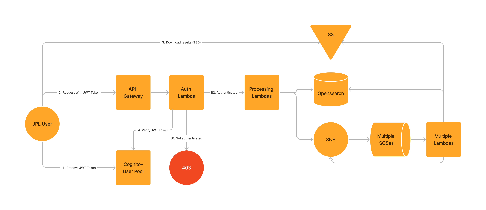

### How Ideas-API is deployed in JPL AWS environment

#### AWS Architecture

#### Intro
1. Opensearch, Lambdas, SNS, and SQS will be deployed using terraform. 
2. S3 buckets are not directly related to this project. The bucket is usually created by process owners which is not directly used by this applications
    3. The application lambdas will access the buckets to retrieve data for processing and to store result data. 

#### Steps
3. Create a VPC. Refer to [VPC diagram](vpc.resource_map.example.png)
2. Create an IAM role for lambda. Refer to [IAM Policy](lambda_role_policy.example.json)
3. Create a Cognito user pool for authentication and authorization. 
    1. Create a App client which will be the client for this system. 
4. Deploy Lambda, SNS, SQS, and Elasticsearch using terraform
5. Create API Gateway. 
    1. setup Cognito Authorizer against Cognito User Pool created in previous step. 
    1. Setup endpoints referencing [idea-api-endpoints.yaml](ideas-api-endpoints.yaml)

   